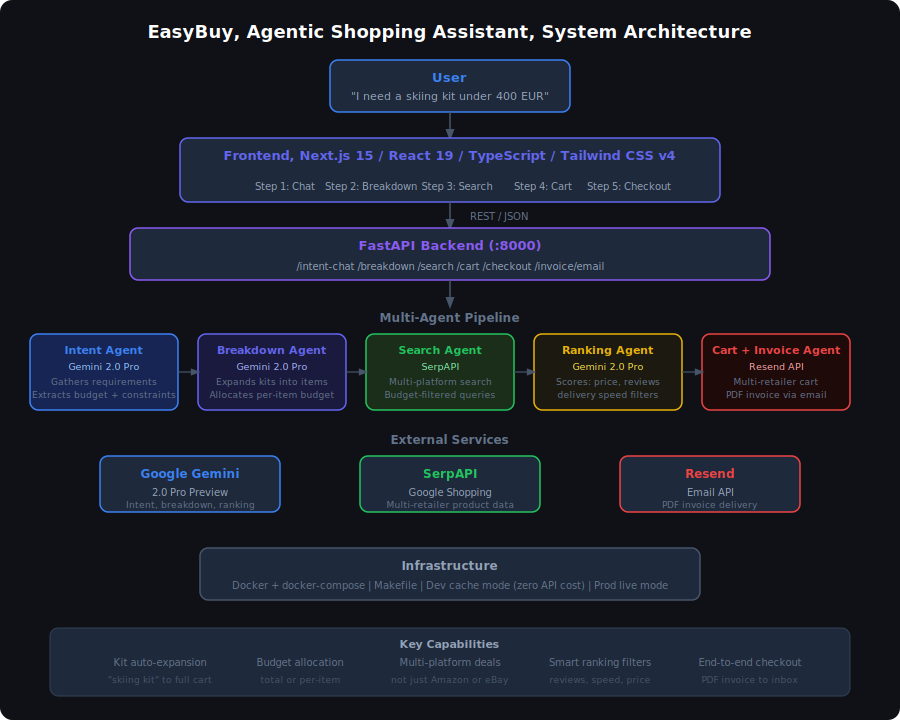

# EasyBuy, Agentic Shopping Assistant

Tell EasyBuy what you need. It figures out everything else.

Say "I need a skiing kit under 400 EUR" and EasyBuy decomposes that into every item the kit needs, searches real listings across multiple retail platforms, ranks them by price, reviews, and delivery speed, assembles your cart, and sends a PDF invoice to your inbox after checkout.

No search bars. No tab switching. No manual filtering.

---

## Demo

[](https://youtu.be/RwBON9lWYF0)


---

## How It Works



---

## What Makes It Different

**Kit-aware shopping**
Most shopping tools need you to list individual items. EasyBuy understands intent. Ask for a "hiking kit" or "home office setup" and it expands that automatically into all relevant product categories, then searches each one independently.

**Budget that actually works**
Set a total budget or define individual limits per item. The agent allocates spend across the full cart intelligently and every recommendation stays within your constraints.

**Cross-platform deal finding**
Results come from multiple retail platforms, not just Amazon or eBay. The goal is the best available deal across the open web.

**Transparent ranking**
Every result is scored. You control the sort: fastest delivery, highest customer reviews, or most budget-friendly. Nothing is hidden in a black box.

---

## Agent Pipeline

Five specialized agents handle each stage of the purchase journey.

| Agent | Role |
|---|---|
| Intent Agent | Gathers requirements through conversation, extracts budget and constraints |
| Breakdown Agent | Expands vague requests into specific product articles, allocates per-item budget |
| Search Agent | Queries SerpAPI across multiple retail platforms with budget filters applied |
| Ranking Agent | Scores results on price, reviews, and delivery speed with user-controlled sort |
| Cart + Invoice Agent | Assembles multi-retailer cart, generates PDF invoice, delivers via email |

Each agent is a dedicated FastAPI endpoint with its own prompt design and structured output schema.

---

## Tech Stack

| Layer | Technology |
|---|---|
| Agent Orchestration | Google Gemini 2.0 Pro Preview, structured prompt chaining |
| Product Search | SerpAPI Google Shopping (multi-platform) |
| Backend | FastAPI, Python, Uvicorn |
| Frontend | Next.js 15, React 19, TypeScript, Tailwind CSS v4 |
| Invoice and Email | PDF generation, Resend API |
| Infrastructure | Docker, docker-compose, Makefile |

---

## Getting Started

```bash
git clone https://github.com/YadavAkash96/easybuy-agent.git
cd easybuy-agent
cp .env.example .env
# Add GEMINI_API_KEY to .env
make up
```

Open `http://localhost:3000`

SerpAPI credits are limited. Dev mode runs against a precomputed cache by default so you can build and test without burning quota.

```bash
make dev    # cached responses, zero API cost (default)
make prod   # live SerpAPI calls
```

---

## About

Built by Akash Yadav and Leo Maglanoc during the 4th Hack-Nation Global AI Hackathon, February 2026, VC Track, Agentic Commerce challenge.

Backend pipeline, agent orchestration, product ranking, budget allocation, and invoice generation by Akash Yadav. Frontend and integration by Leo Maglanoc.

yadavakash1996@outlook.com
